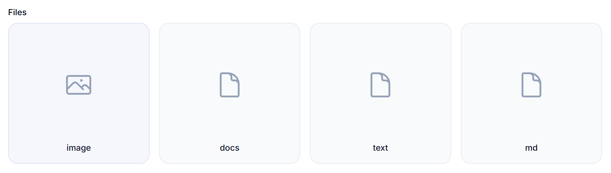
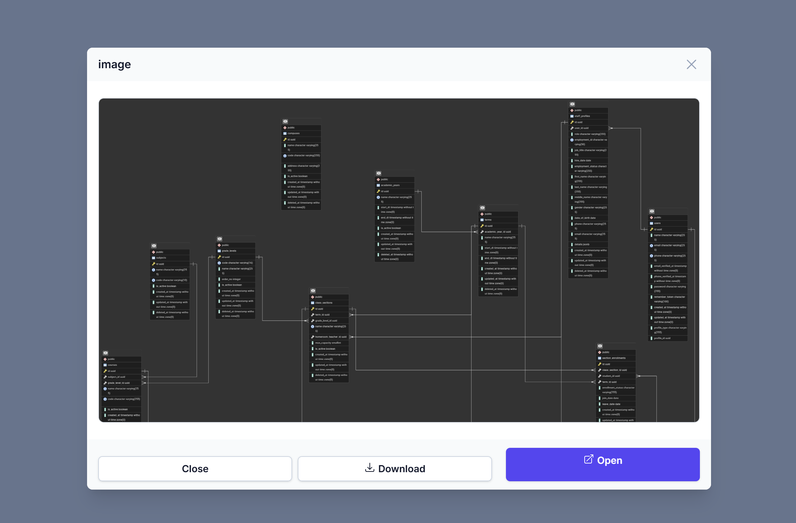
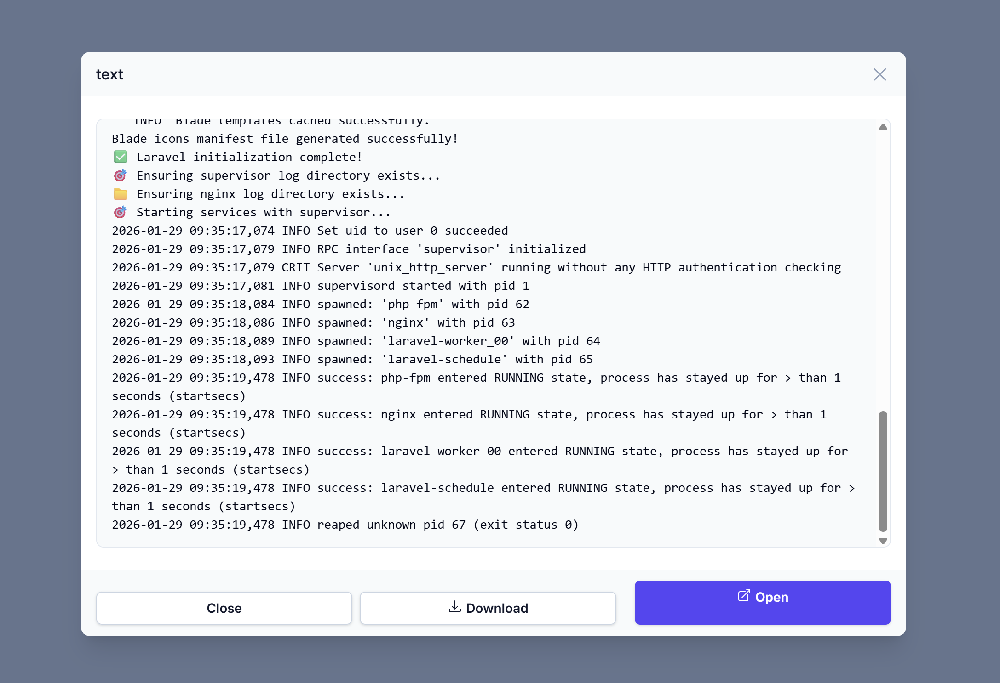
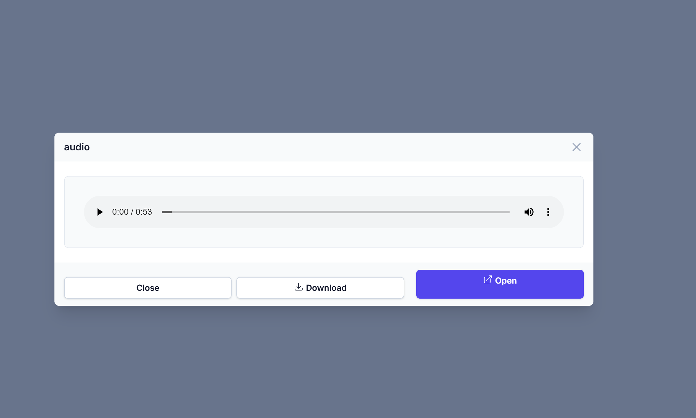

# Filament File View Entry

A Filament plugin that provides a beautiful file attachment viewer for Infolists with type-specific icons, modal previews, and responsive grid layout.

<p align="center">
  
</p>

## Features

- 🎨 **Beautiful card layout** with file type icons
- 🔍 **Modal preview** for images, videos, audio, PDFs, and text files
- 📱 **Responsive grid** - auto-adjusts columns based on screen size
- 🌙 **Dark mode support**
- 📥 **Download option**
- 🔧 **Customizable data keys** - works with any data structure
- 📦 **Collection support** - works with Eloquent relationships

## Installation

```bash
composer require gheith3/filament-file-view-entry
```

## Quick Start

### Register the Plugin

In your panel provider:

```php
use gheith3\FileViewEntryPlugin\FileViewEntryPlugin;

public function panel(Panel $panel): Panel
{
    return $panel
        ->plugin(FileViewEntryPlugin::make());
}
```

### CSS Configuration (Custom Theme)

If your panel uses a **custom theme** registered in `vite.config.js`, add the following line to your theme's CSS file:

```css
@source '../../../../vendor/gheith3/filament-file-view-entry/resources/views/**/**';
```

Then recompile your assets:

```bash
npm run dev
```

> **Note:** This step is only required when using a custom Vite theme. The plugin works out of the box with Filament's default setup.

### Basic Usage

```php
use gheith3\FileViewEntryPlugin\Infolists\Components\FileViewEntry;

// Single file
FileViewEntry::make('file_path')
    ->showPreview()
    ->downloadable();

// Multiple files in grid
FileViewEntry::make('attachments')
    ->grid(4)
    ->showPreview()
    ->downloadable();
```

## Configuration

### Data Structure Mapping

If your data uses different keys:

```php
FileViewEntry::make('documents')
    ->grid(3)
    ->titleKey('title')        // Default: 'name'
    ->pathKey('path')          // Default: 'file_path'
    ->dateKey('uploaded_at')   // Default: null (hidden)
    ->showPreview()
    ->downloadable();
```

### Available Methods

| Method                               | Description                             |
| ------------------------------------ | --------------------------------------- |
| `grid(int $columns)`                 | Set grid columns (1-6, auto-responsive) |
| `titleKey(string $key)`              | Key for file title                      |
| `pathKey(string $key)`               | Key for file path                       |
| `dateKey(?string $key)`              | Key for date (null to hide)             |
| `asModal(bool $enabled)`             | Show content in modal (default: true)   |
| `disk(string $disk)`                 | Storage disk name                       |
| `showPreview(bool $enabled)`         | Enable/disable modal preview            |
| `downloadable(bool $enabled)`        | Show download button                    |
| `previewHeight(int\|string $height)` | Modal height (default: 300px)           |

### Grid Columns Reference

```php
FileViewEntry::make('files')
    ->grid(2)  // 2 columns on all screens
    ->grid(3)  // 2 cols mobile, 3 cols tablet+
    ->grid(4)  // 2 cols mobile, 3 tablet, 4 desktop
    ->grid(5)  // 2 cols mobile, 3 tablet, 4 desktop, 5 xl
    ->grid(6)  // 2 cols mobile, 3 tablet, 4 desktop, 6 xl
```

## Examples

### With Eloquent Relationship

```php
// In your resource
public static function infolist(Infolist $infolist): Infolist
{
    return $infolist
        ->schema([
            FileViewEntry::make('uploadedFiles') // relationship name
                ->label('Attachments')
                ->grid(6)
                ->showPreview()
                ->downloadable(),
        ]);
}
```

### Custom Data Array

```php
$data = [
    ['title' => 'Contract.pdf', 'document_path' => 'docs/contract.pdf'],
    ['title' => 'Photo.jpg', 'document_path' => 'images/photo.jpg'],
];

FileViewEntry::make('customData')
    ->titleKey('title')
    ->pathKey('document_path')
    ->grid(2);
```

### Display Content Inline (No Modal)

```php
// Show files directly on the page instead of in a modal
FileViewEntry::make('attachments')
    ->asModal(false)           // Display content inline
    ->showPreview()            // Still show the content
    ->downloadable()
    ->grid(2);
```

## Customization

### Publish Views

```bash
php artisan vendor:publish --tag=file-view-entry-plugin-views
```

Edit `resources/views/vendor/file-view-entry-plugin/infolists/components/file-view-entry.blade.php`

## Screenshots

### Grid Layout with File Type Icons
<p align="center">
  
</p>

### Modal Preview - Image
<p align="center">
  
</p>

### Modal Preview - Text Files
<p align="center">
  
</p>

### Modal Preview - Audio
<p align="center">
  
</p>

## Supported File Types

| Type  | Extensions                          | Preview          |
| ----- | ----------------------------------- | ---------------- |
| Image | jpg, jpeg, png, gif, bmp, svg, webp | ✓                |
| Video | mp4, mov, avi, mkv, webm, flv, wmv  | ✓                |
| Audio | mp3, wav, ogg, flac, aac, m4a       | ✓                |
| PDF   | pdf                                 | ✓                |
| Text  | txt, md                             | ✓                |
| Other | \*                                  | Opens in new tab |

## Requirements

- PHP ^8.1
- Laravel ^10.0 || ^11.0 || ^12.0
- Filament ^4.0

## License

The MIT License (MIT). Please see [License File](LICENSE.md) for more information.

## Credits

- Created by [Gheith](https://github.com/gheith3)
- Inspired by the Filament community

## Support

- 🐛 [Report Issues](https://github.com/gheith3/FileViewEntryPlugin/issues)
- 💡 [Request Features](https://github.com/gheith3/FileViewEntryPlugin/discussions)
